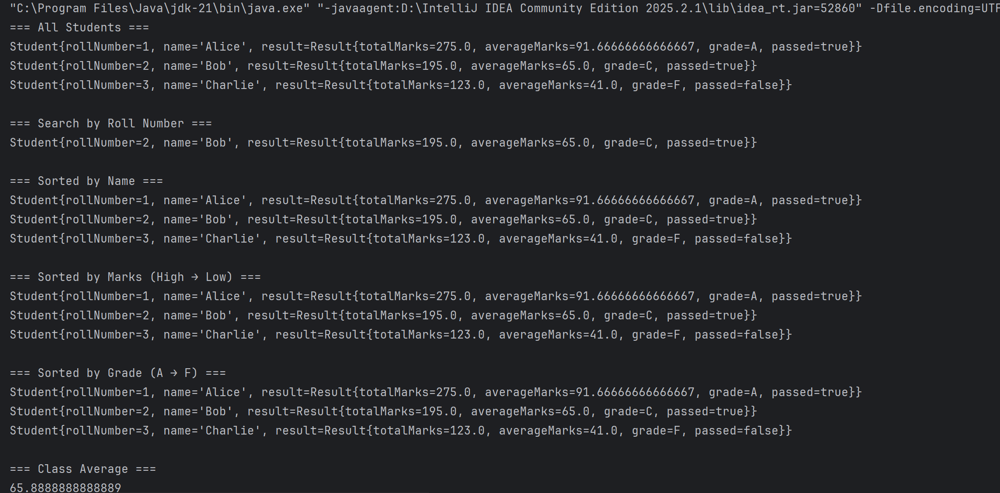
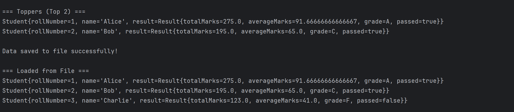

<h1 align="center"> JavaProject-Student-Result-Management</h1>

  A complete <b>Student Result Management System</b> built in <b>Java</b>.  
  Manage student records, generate results, and simplify academic evaluation in just a few clicks! 🎓

<h2>✨ Features</h2>
<ul>
  <li> Add, update, and delete student records</li>
  <li> Generate student result reports</li>
  <li> Search students by roll number, name, or class</li>
  <li> Store results with subject-wise marks</li>
  <li> Export results (optional: CSV/Excel/PDF if implemented)</li>
  <li> User-friendly GUI for teachers/admins</li>
</ul>

<h2>🛠️ Tech Stack</h2>
<ul>
  <li><b>Language:</b> Java</li>
</ul>

<h2>📂 Project Structure</h2>

<pre>
JavaProject-Student-Result-Management/
── src/
   ├── app/
   │    └── Main.java
   ├── comparators/
   │    └── StudentGradeComparator.java
   │    └── StudentMarksComparator.java
   │    └── StudentNameComparator.java
   ├── exceptions/
   │    ├── StudentNotFoundException.java
   ├── models/
   │    ├── Result.java
   │    ├── Student.java
   │    └── Subject.java
   ├── services/
   │    ├── FileStorageService.java
   │    ├── ResultService.java
   │    └── StudentService.java
   ├── utils/
   │    ├── InputValidator.java
   │    ├── StreamUtils.java
</pre>

<h3>🔹 Running the Application</h3>
<ol>
  <li>Compile the Java files:
    <pre><code>javac Main.java</code></pre>
  </li>
  <li>Run the application:
    <pre><code>java Main</code></pre>
  </li>
  <li>Login as Admin/Teacher → Manage students → Generate results 🎉</li>
</ol>

<h2>📸 Screenshots</h2>

  
  

<h2>✅ Conclusion</h2>

The <b>JavaProject-Student-Result-Management</b> provides a simple yet powerful solution 
to manage academic records efficiently. From storing student details to generating 
subject-wise results, the system automates the traditional manual process and reduces 
errors. 

